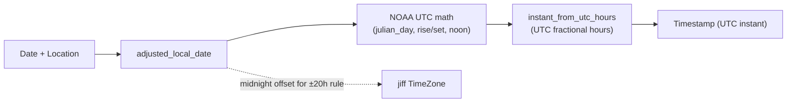

# kosher-rust — Code Review Findings

**Date:** 2026-05-29  
**Scope:** Production code in `src/` (not README/Cargo marketing copy). Interop and historical `crates/` noted where relevant.  
**Source:** [Thorough Code Review Plan](pla). Consolidated from phased deep review and executive synthesis.

Each detailed section uses: **Findings**, **Evidence**, **Recommendation**, **Test gap**.

## Executive summary

The codebase is in **good shape** for a `no_std` halachic-time library: no `unsafe`, consistent `Result`/`Option` in production paths, strong Java parity for zmanim, and solid limud unit coverage. The highest-impact gaps are **codegen drift** (`presets.rs` out of sync with `tools/dsl.py`), **test depth** on astronomy/molad internals and DST edge cases, **dead API surface** (`LocalNoonError`), and **maintainability** risks (manual `defmt` for `ZmanPrimitive`, WASM tractate names via `Debug`). Workspace consolidation removed duplicate `crates/` on `main` (`f7ee5aa`); CI now includes a **`codegen`** job to prevent preset drift recurrence.

## Baseline (2026-05-29)

| Command | Result |
|---------|--------|
| `cargo hack check --feature-powerset --no-dev-deps` | Pass (6 feature combos) |
| `cargo clippy --workspace --all-targets -- -D warnings` | Pass |
| `cargo test --lib` | **164 passed** |
| `uv run python tools/generate-rust.py` then `git diff src/zmanim/presets.rs` | **Fail** — ~1,228-line diff; committed file has **100** presets, generator emits **169** (DSL `ZMAN` = 168) |

## Verified OK (no action required)

| Check | Result |
|-------|--------|
| `unsafe` in codebase | **None** |
| Production `unwrap`/`expect` in `src/` (non-test) | **Only** hard-coded cycle dates in limudim with `#[allow(clippy::expect_used)]` — acceptable |
| `cargo hack check` feature powerset | **Pass** |
| Limud `while` loops | Bounded: cycle advances, interval advances to `cycle.end_date`, mishna chapter loops finite |
| Parsha search | Bounded `for _ in 0..60` in `calendar/mod.rs` |
| Astronomy coarse search | `while hour <= 24.0` step 0.25h + 30-iter ternary refinement |
| Omer range | `Sivan day < 6` → days 1–49 end on 5 Sivan; day 6 excluded — matches Java |
| Candle lighting l'chumrah | Documented in `primitives.rs` — earlier sea-level sunset |
| Halachic policy comments | Good inline rationale for candle lighting vs other zmanim |
| `crates/` duplicate tree | **Removed** on `main` — canonical library is root `kosher-rust` |

---

## Phase 0 — Cross-cutting inventory

| Category | Count / status | Notes |
|----------|----------------|-------|
| `unsafe` in `src/`, `crates/`, `interop-tests/` | **0** | Clean |
| Production `panic!` | **0** | Only `calendar/tests.rs` |
| Production `unwrap` / `expect` | **0** in `src/` production modules | All in `#[cfg(test)]` or `tests.rs` |
| `#[allow(...)]` in `src/` | ~25 sites | Mostly `missing_docs` on month/units enums; `calendar/mod.rs` test module allows panics; `limud_calculator` `private_bounds` |
| `deprecated: true` presets | **24** | Still listed in `for_all_zman_presets!` → Java parity includes them |
| `TODO` / `FIXME` | **1** | `Cargo.toml`: defmt + jiff integration |
| `ZmanimError::LocalNoonError` | **Defined, never returned** | DST-gap noon not surfaced |
| Integer casts (`as u8` / `usize` / `i8`) | **~30** production sites | See Phase 17 table in plan |
| Option vs Result | Limud → `Option`; Zmanim → `Result` | Intentional split; document for callers |

### Loops inventory

| Location | Bound | Termination |
|----------|-------|-------------|
| `astronomy.rs` coarse azimuth scan | `hour <= 24.0`, step 0.25h | Fixed ~97 iterations |
| `astronomy.rs` ternary refine | `for _ in 0..30` | Fixed |
| `astronomy.rs` solar noon iterate | `for _ in 0..2` | Fixed |
| `calendar/mod.rs` parsha search | `for _ in 0..60` | Bounded; returns `None` if exhausted |
| `holiday.rs` `HolidayIterator` | `loop` over static holiday slice | Finite iterator; may skip many items per `next()` |
| `limud_calculator.rs` | `while !interval.contains` | Advances interval each iteration — needs formal bound proof (Phase 6) |
| `cycle.rs` | `while date > cycle.end_date` | Walks backward through finite cycle table |
| `daf_yomi_yerushalmi.rs` | `while found_days > 0` | Decrements `found_days` — needs holiday-cluster stress test |
| `molad.rs` gregorian conversion | `while abs_date >= …` / `while abs_date > …` | Year/month advance toward target |

### Public API surface (`src/lib.rs`)

- `calendar`, `limudim`, `zmanim` modules + unified `prelude`
- `#![cfg_attr(not(test), no_std)]`; default feature `alloc`

---

## Phase 1 — Foundation

### Finding (major): Dead error variant `LocalNoonError`

**Evidence:** `src/zmanim/types/error.rs` defines `LocalNoonError`; ripgrep shows no `return Err(LocalNoonError)` or `Err(ZmanimError::LocalNoonError)` anywhere.

**Recommendation:** Either return it from `solar_noon` / chatzos paths when local noon is missing in a DST gap, or remove the variant and document that jiff resolves ambiguous noon another way.

**Test gap:** US spring-forward date in `America/New_York` — assert `solar_noon` / `CHATZOS_HAYOM` behavior vs KosherJava.

### Finding (minor): No direct unit tests for `config.rs` / `error.rs`

**Evidence:** `location.rs` has 3 inline tests; config/error have none.

**Recommendation:** Add tests for invalid lat/lon/elevation mapping to error variants.

### Finding (minor): `Location::new` does not reject `±infinity`

**Evidence:** `src/zmanim/types/location.rs` checks `is_nan()` but not `is_infinite()` on lat/lon/elevation.

**Recommendation:** Treat infinity like NaN for lat/lon/elevation.

**Test gap:** `Location::new` with `f64::INFINITY` coordinates.

---

## Phase 2 — Calendar

### Finding (nit): `HolidayIterator` scans full holiday list per item

**Evidence:** `src/calendar/holiday.rs` — `loop { let holiday = self.iter.next()?; … }` over all static holidays.

**Recommendation:** Accept for now; document O(n) per yielded holiday. Consider indexing by month/day if embedded perf matters (Phase 16).

### Finding (minor): Parsha search cap 60 weeks

**Evidence:** `src/calendar/mod.rs` lines 267–276.

**Recommendation:** Add comment linking 60 to ~ICU limit edge cases; add test at max supported Hebrew year if ICU documents bounds.

### Phase 2 — Calendar (deep) — summary

**Verdict:** Molad/chalakim/dehiyyot, leap-year rules, Chanukah/Omer boundaries, and parsha year-type selection align with KosherJava. Java interop (5600–5900 + random) is the main correctness backstop. 35/35 `cargo test --lib calendar` pass.

| Sev | Finding | Test gap |
|-----|---------|----------|
| major (risk) | Dual authority: ICU dates vs custom `get_hebrew_elapsed_days` — drift on ICU upgrade | Golden dehiyyot; exact `765433` chalakim delta |
| major (edge) | `upcoming_parsha` 60-week cap vs Java unbounded loop | Case where Rust `None` but Java succeeds |
| minor | `has_candle_lighting` uses `next_day.is_assur_bemelacha` vs Java erev-yom-tov helpers | RH day 1 Israel, Chol Hamoed erev fixtures |
| minor | Weak dehiyyot/chanukah unit tests (`chalakim` only ±100) | Tevet 2/3 short Kislev; Sivan 5/6 Omer |
| nit | Omer `day < 6` on Sivan excludes Shavuot — matches Java | Document inclusive range |
| nit | `ROSH_HASHANA_WEEKDAYS[(elapsed+1) % 7]` — matches Java `getParshaYearType` | Kesidran → `None` golden |

**P0:** None in interop-covered years; **P1:** strengthen molad/dehiyyot and boundary tests; document 60-week cap and candle-lighting equivalence.

---

## Phase 3 — Astronomy

### Finding (major): No direct unit tests for `astronomy.rs`

**Evidence:** Coverage only via `zmanim/tests.rs` presets and Java interop.

**Recommendation:** Extract golden tests for `julian_day`, `equation_of_time`, polar `AllDay`/`AllNight`, azimuth search failure (`best_error > 5.0`).

**Test gap:** Mirror KosherJava `AstronomicalCalculator` spot values; keep 1000 ms tolerance in interop for full presets only.

### Finding (minor): Azimuth denominator guard

**Evidence:** `astronomy.rs` ~164–171 — `az_denom.abs() > 0.001` branch.

**Recommendation:** Document pole/zenith behavior; add polar latitude case to unit tests.

---

## Phase 12 — Timezone / DST

### Finding (major): Ambiguous midnight uses `.earlier()`

**Evidence:**

```231:249:src/zmanim/astronomy.rs
pub(crate) fn adjusted_local_date(date: Date, location: &Location) -> Result<Date, ZmanimError> {
    // ...
    let midnight = timezone
        .to_ambiguous_timestamp(date.at(0, 0, 0, 0))
        .earlier()
        .map_err(|_| ZmanimError::TimeConversionError)?;
```

**Recommendation:** Document invariant (match KosherJava `AstronomicalCalendar`); add DST fall-back and spring-forward fixture tests for Lakewood and Jerusalem.

### Finding (major): `LocalNoonError` unused (see Phase 1)

Cross-ref: `instant_from_utc_hours` adjusts date for noon but does not detect DST gaps.

---

## Phase 13 — API semantics

### Finding (minor): 24 deprecated presets still in parity macro

**Evidence:** `deprecated: true` × 24 in `presets.rs`; `for_all_zman_presets!` includes all active names (no filter).

**Recommendation:** Split macro into `for_all_active_zman_presets!` for parity; keep deprecated exports behind `#[deprecated]` only.

---

## Phase 14 — FFI

### Finding (major): WASM tractate names via `Debug`

**Evidence:** `interop-tests/js_interop_tests/src/lib.rs`:

```11:14:interop-tests/js_interop_tests/src/lib.rs
impl From<Tractate> for SerializableTractate {
    fn from(t: Tractate) -> Self {
        SerializableTractate(format!("{:?}", t))
```

**Recommendation:** Use explicit stable name table (TS tests already map Hebcal names).

**Test gap:** Assert WASM JSON tractate strings match TS fixture table.

---

## Phase 15 — Codegen

### Finding (critical): `presets.rs` out of sync with generator

**Evidence:** `uv run python tools/generate-rust.py` → `git diff` shows ~1,228 lines changed on `src/zmanim/presets.rs` (reverted after verification).

**Recommendation:** Regenerate, review diff, commit; CI `codegen` job added in `.github/workflows/tests.yaml` to prevent recurrence.

**Test gap:** CI step runs generator and `git diff --exit-code`.

---

## Phase 8 — Interop

### Finding (minor): Kiddush levana / molad parity years limited

**Evidence:** `interop-tests/java_interop_tests/src/zmanim/policy.rs` — years 1990–2030 for molad/kiddush levana getters.

**Recommendation:** Document timezone divergence; extend range once jiff/KosherJava alignment confirmed.

### Limud parity matrix (confirmed)

| Schedule | Java interop |
|----------|--------------|
| Daf Yomi Bavli | yes |
| Daf Yomi Yerushalmi | yes |
| Daf Hashavua, Dirshu, Mishna Yomis, Pirkei Avos, Tehillim | **no** (JS/Hebcal only) |

---

## Phase 10 — `crates/` duplication (deep)

**Status (`main`):** Consolidation **already completed** in `f7ee5aa` (“boom”). `crates/` no longer exists; canonical library is root **`kosher-rust`** in `src/`. Workspace members: `interop-tests/java_interop_tests`, `interop-tests/js_interop_tests` only.

| Former | Current |
|--------|---------|
| `crates/hebrew-holiday-calendar` | `src/calendar/` |
| `crates/limudim-calendar` | `src/limudim/` |
| `crates/limudim-calendar/limudim-wasm` | `interop-tests/js_interop_tests/` |
| `crates/zmanim-calculator` + embedded `java/` | `src/zmanim/` + `third-party/kosher-java` + `interop-tests/java_interop_tests/` |

**Recommendation:** Do not restore or CI-wire old `crates/*`. Update `pla` Phase 0/10 notes accordingly. Single Java reference: `third-party/kosher-java`.

---

## Prioritized backlog (Phase 11 synthesis)

### P0 — Correctness / drift

1. **Regenerate and commit `presets.rs`** — committed file still 100/168 presets; CI `codegen` job will fail until fixed.
2. **Verify `adjusted_local_date` `.earlier()`** — document and test DST ambiguous midnight.

### P1 — Test gaps (high-risk math)

1. Direct `astronomy.rs` unit tests (polar, azimuth, Julian day).
2. DST-gap / `LocalNoonError` behavior for chatzos and solar noon.
3. `limud_calculator` / Yerushalmi loop termination property or cap + test.
4. Java interop for 5 limud schedules without parity (or document intentional Hebcal-only).

### P2 — API / maintainability

1. Split `for_all_zman_presets!` for deprecated presets in parity.
2. Replace WASM `Debug` tractate names with stable strings.
3. `HolidayIterator` perf note for embedded users.
4. Manual `defmt::Format` on `ZmanPrimitive` — compile-time check or test that variant count matches enum.

### P3 — Nits

1. Doc tests on public prelude types.
2. `cargo.toml` defmt+jiff TODO.
3. proptest / Miri — methodology backlog (Lens B in plan).

---

## Phase 1 & 13 — Foundation & API (deep)

### Mental model: features and `no_std`

| Build | Behavior |
|-------|----------|
| Default (`alloc`) | Full API: preset descriptions, `ZmanPreset::description()`, `String` in generated `presets.rs`. |
| `--no-default-features` | `no_std` library still builds. Zman **times** unchanged; **metadata/descriptions** stripped. |
| `defmt` (optional) | `Format` on `Location`, `CalculatorConfig`, `ZmanimCalculator`, `ZmanPreset`, `ZmanimError`. `CalculatorConfig` defmt omits `use_elevation` (oversight). |

`alloc` is an empty feature flag — it only gates `extern crate alloc` and description machinery in `src/zmanim/mod.rs` and generated `presets.rs`.

### Finding (major): `ZmanimError::LocalNoonError` unreachable

**Evidence:** Defined in `src/zmanim/types/error.rs`; no `Err(ZmanimError::LocalNoonError)` anywhere in `src/`. `solar_noon` uses `instant_from_utc_hours` date nudges instead.

**Recommendation:** Return `LocalNoonError` when jiff cannot resolve noon on gap days, or remove the variant and document jiff behavior.

**Test gap:** Spring-forward `America/New_York` — `SUN_TRANSIT` / `CHATZOS_HAYOM` vs KosherJava.

### Finding (major): `Location` validation bypass

**Evidence:** `Location` fields are `pub`; `ZmanimCalculator::new` does not re-validate. Only `Location::new` checks ranges, anti-meridian, NaN.

**Recommendation:** Make fields private with getters, or validate in `ZmanimCalculator::new`.

**Test gap:** NaN coordinates via struct literal → document or reject at calculate time.

### Finding (minor): `ZmanPreset` struct shape differs with vs without `alloc`

**Evidence:** `description` field and `ZmanPreset::description()` are `#[cfg(feature = "alloc")]`.

**Recommendation:** Document semver hazard if publishing both feature sets as one API.

### Finding (minor): No unit tests for `config.rs` / `error.rs`

**Evidence:** `location.rs` has 3 tests; `CalculatorConfig::default` and error mapping untested.

### Finding (minor): `Location::new` does not reject `±infinity`

**Evidence:** `location.rs` checks `is_nan()` only.

**Recommendation:** Reject `is_infinite()` on lat/lon/elevation like NaN.

### `ZmanimError` variant reachability

| Variant | Reachable | Source |
|---------|-----------|--------|
| `InvalidLatitude` / `InvalidLongitude` / `InvalidElevation` | Yes | `Location::new` |
| `TimeZoneRequired` | Yes | `Location::new`; molad/kiddush without `timezone` |
| `CalculationError` | Yes | `astronomy.rs` |
| **`LocalNoonError`** | **No** | — |
| `AllDay` / `AllNight` | Yes | Polar rise/set |
| `TimeConversionError` | Yes | `adjusted_local_date`, timestamp mapping |
| `ErevPesachZman` | Yes | Chametz presets |
| `InvalidHours` | Yes | `LocalMeanTime` |

### Option vs `Result` across domains

| Domain | Pattern |
|--------|---------|
| Zmanim | `Result<Timestamp, ZmanimError>` |
| Calendar | `Option` for parsha, omer, chanukah |
| Limud | `Option<U>` |

Document: limud/calendar “missing” → `Option`; zmanim failures → `Result`.

### Deprecated presets (public API)

24× `deprecated: true` in `presets.rs` — metadata only, not `#[deprecated]`. Still in `ALL_ZMANIM` and `for_all_zman_presets!`.

### Blanket trait surprises

`HebrewCalendarDate` for any `icu_calendar::Date<C>` + `jiff::civil::Date`; `HebrewHolidayCalendar` and `LimudCalendar` for any `T: HebrewCalendarDate` — powerful; ICU edge dates → `None` without error.

### Stability audit highlights

- `pub mod molad` exposes no public items — consider `pub(crate)`.
- `ZmanPrimitive` fully public — enum changes are breaking.
- `Location` pub fields bypass validation.
- `for_all_zman_presets!` is `#[macro_export]` — stable test contract.

### Foundation/API test backlog

1. `Location` / `ZmanimError` mapping tests (including NaN).
2. DST-gap noon policy test.
3. `cfg` test: no `alloc`, assert `calculate` works, `description()` absent.
4. `for_all_active_zman_presets!` vs deprecated metadata.

---

## Phase 6, 7 & 17 — Limudim (deep)

**Scope:** `src/limudim/{limud_calculator,cycle,interval,units,mod}.rs` + all seven schedule modules; Java interop matrix; cast/loop audit.

### Architecture summary

| Layer | Role |
|-------|------|
| `LimudCalculator` / `InternalLimudCalculator` | Default `limud()`: find cycle → walk intervals → `unit_for_interval` |
| `Cycle` | Initial (iterated) vs perpetual (monthly / Pirkei Avos year) |
| `Interval` | Sub-range within cycle; `next` / `skip`; `contains` is inclusive |
| `LimudCalendar` | `Date<Hebrew>::limud(calculator)` via `HebrewCalendarDate` |

**Dual pattern:** Bavli, Yerushalmi, Dirshu, Mishna Yomis **override `limud()`**. Hashavua, Pirkei Avos, Tehillim use the **default** interval engine.

### Loop termination

| Loop | Location | Verdict |
|------|----------|---------|
| `while !interval.contains` | `limud_calculator.rs:19` | Terminates — finite intervals per cycle |
| `while date > cycle.end_date` | `cycle.rs:37` | Terminates — O(cycle index) |
| `while limud_date >= next_cycle` | `daf_yomi_yerushalmi.rs:70` | Terminates |
| `while found_days > 0` | `daf_yomi_yerushalmi.rs:98` | Believed terminating — **needs stress test** |

### Finding (major): `unit_for_interval` → `self.limud()` on 3 calculators

**Evidence:** `daf_yomi_bavli`, `amud_yomi_bavli_dirshu`, `mishna_yomis` delegate `unit_for_interval` to overridden `limud()` — violates documented contract at `limud_calculator.rs:51-52`.

**Recommendation:** Extract shared offset helpers; remove dead `unit_for_interval` bodies.

### Parity matrix

| Schedule | Rust tests | Java | JS/Hebcal |
|----------|------------|------|-----------|
| Daf Yomi Bavli | 11 | yes | yes |
| Daf Yomi Yerushalmi | 28 | yes | yes |
| Daf Hashavua | 4 | no | yes |
| Amud Yomi Dirshu | 13 | no | **no test file** (WASM only) |
| Mishna Yomis | 29 | no | yes |
| Pirkei Avos | 14 | no | yes |
| Tehillim Monthly | 7 | no | yes |

Framework (`cycle`, `interval`, `limud_calculator`, `units`): **0** direct tests.

### Limudim findings backlog

| Sev | Finding | Test gap |
|-----|---------|----------|
| P1 | Yerushalmi `found_days` loop unproven under stress | `test_yerushalmi_cycle_heavy_holiday_year` |
| P1 | Dirshu no JS interop | `amud_yomi_dirshu.test.ts` |
| P1 | Framework modules untested | interval/cycle unit tests |
| P2 | `days_between` semantics undocumented | boundary asserts |
| P2 | Five schedules Java-less | document Hebcal/WASM-only |

---

## Phase status tracker

| Phase | Status | Owner lane |
|-------|--------|------------|
| 0 | **Done** (this doc) | Quality |
| 1 | **Done (deep)** | API |
| 13 | **Done (deep)** | API |
| 2 | **Done (deep)** | Calendar |
| 3 | **Done (deep)** | Zmanim/math |
| 4–5 | **Done** (deep section below) | Zmanim/math |
| 18 | **Done** (deep section below) | Zmanim/math |
| 6–7 | **Done (deep)** | Limudim |
| 17 (limudim) | **Done (deep)** | Limudim |
| 8–9 | **Deep done** | Quality |
| 14–16 | **Deep done** | Quality / FFI / embedded |
| 10 | **Done (deep)** — `crates/` removed on `main` | Quality |
| 11 | Backlog above | All |
| 12 | **Done (deep)** | Zmanim/math |
| 15 | Hotspot in Phase 15 | Per plan roles |

---

## Do-less backlog (avoid over-engineering)

1. **~300 Java zmanim test fns** — valuable; do not duplicate with redundant unit tests for every preset if parity passes.
2. **Do not hand-review all ~3,300 lines of `presets.rs`** — review `dsl.py` + generator instead.
3. **Do not restore `crates/`** — consolidation is done; single Java reference: `third-party/kosher-java`.

---

## Test backlog (actionable)

1. `test_adjusted_local_date_dst_fall_back_lakewood` — compare civil date shift vs Java on fall-back Sunday.
2. `test_solar_noon_dst_gap_returns_local_noon_error` — if policy is to error; else document jiff resolution.
3. `test_azimuth_search_polar_reykjavik_summer` — azimuth presets do not return `CalculationError` spuriously.
4. `test_molad_chalakim_roundtrip` — integer chalakim → ms → calendar molad in `calendar/mod.rs`.
5. `test_yerushalmi_cycle_heavy_holiday_year` — `found_days` loop on known dense cluster.
6. CI: `uv run python tools/generate-rust.py && git diff --exit-code src/zmanim/presets.rs`
7. `test_get_molad_dehiya_day_increment` — hours ≥ 6 must advance Gregorian date in `_get_molad`.
8. `test_molad_chalakim_subsecond_roundtrip` — f64 → `i8` seconds + nanos vs integer chalakim.
9. `test_chatzos_half_day_fallback_on_all_day` — half-day `Err` masks polar `AllDay` with `SolarTransit`.
10. Regenerate `presets.rs` and re-baseline Java parity count (100 → 168 tests).
11. **DST gap noon** — `America/New_York` spring-forward; chatzos / solar transit behavior.
12. **Limud toy calculator** — minimal `InternalLimudCalculator` proving `limud_calculator` loop terminates.
13. **Yerushalmi `cycle_end_date`** — property: `while found_days > 0` terminates within N iterations for dense holiday clusters.
14. **Optional:** `proptest` for `Location::new` valid ranges; fuzz `degrees` on offset presets.

## Suggested next actions (priority order)

1. Regenerate and commit `presets.rs` (CI `codegen` gate).
2. Add DST fall-back / spring-forward fixtures for `adjusted_local_date` and chatzos.
3. Add `astronomy.rs` unit test module (julian day, polar errors, azimuth failure).
4. Harden molad time conversion (`_get_molad` day increment; avoid `as i8` / `f64` chalakim path).
5. Resolve `LocalNoonError` — remove or document as unused (UTC-anchored noon).
6. Fix `CalculatorConfig` defmt missing `use_elevation`; stable WASM tractate names.
7. Add `amud_yomi_bavli_dirshu` JS interop test; cap calendar/limud rejection loops.

---

## Phase 4, 5 & 18 — Primitives, molad, halachic policy (deep)

**Scope:** `tools/dsl.py`, `tools/generate-rust.py`, `src/zmanim/primitives.rs`, `src/zmanim/molad.rs`, `src/calendar/mod.rs` (molad chalakim), `src/zmanim/presets.rs`, `src/zmanim/mod.rs`.

**Verification (2026-05-29):** `uv run python tools/generate-rust.py` from `tools/` → `git diff src/zmanim/presets.rs` shows ~1,228 lines changed; `pub static` count **100** (committed) vs **169** (generated). DSL: `len(ZMAN)=168`, `deprecated=24`, `zman is None=0`. CI `codegen` job in `.github/workflows/tests.yaml` will fail until regenerated and committed.

### Finding (critical): `presets.rs` missing ~68 presets vs DSL

**Evidence:** Committed `presets.rs` has 100 `pub static` presets and 100 `for_all_zman_presets!` expansions; generator + `tools/dsl.py` define 168 zmanim. Java parity (`interop-tests/java_interop_tests/src/zmanim/parity_tests.rs`) expands one test module per macro entry → **~68 presets have no parity tests**.

**Recommendation:** Regenerate from `tools/dsl.py`, review diff, commit; expect `cargo test` in `java_interop_tests` to grow ~68×3 tests. Keep CI `codegen` gate.

**Test gap:** After regen, assert `ALL_ZMANIM.len() == ZMAN.len()` via a small Rust or Python check in CI.

---

### Finding (major): `_get_molad` discards dehiyah day increment

**Evidence:** `src/zmanim/molad.rs` — when conjunction hour ≥ 6, code calls `try_add_with_options(..., +1 day)` but does not assign the result:

```197:201:src/zmanim/molad.rs
    if hours >= 6 {
        gregorian_date
            .try_add_with_options(DateDuration::for_days(1), DateAddOptions::default())
            .ok()?;
    }
```

Molad times after 6 PM Jewish reckoning should fall on the next civil day; without assignment, molad zmanim and Kiddush Levana windows can be wrong by one day.

**Recommendation:** `gregorian_date = gregorian_date.try_added_with_options(...)?` (or equivalent ICU API). Cross-check against KosherJava `JewishCalendar` molad / dehiyah.

**Test gap:** Hebrew month where molad hour ≥ 18 (after `hours = (hours + 18) % 24` path); compare molad timestamp to Java interop on boundary days.

---

### Finding (major): Molad chalakim → time uses `f64` and `as i8` casts

**Evidence:** `months_molad` in `molad.rs`:

```214:222:src/zmanim/molad.rs
    let molad_seconds = molad_data.chalakim as f64 * 10.0 / 3.0;
    let seconds = molad_seconds as i8;
    let nanos = ((molad_seconds - seconds as f64) * 1_000_000_000.0) as i32;
    // ...
        molad_data.hours as i8,
        molad_data.minutes as i8,
```

Integer chalakim (0–17 per minute) are converted via `f64`; seconds use `as i8` (range OK for chalakim, fragile if invariants change). Sub-chalakim precision depends on float remainder for nanos.

**Cross-ref:** `src/calendar/mod.rs` `chalakim_since_molad_tohu` uses pure `i64` chalakim for Rosh Hashana dehiyah — zmanim molad path is separate and can diverge from calendar postponement math.

**Recommendation:** Compute time-of-day as `(chalakim * 10_000_000_000) / 3` nanoseconds from integer parts; avoid `f64` in the hot path; document invariant that hours/minutes fit `i8`.

**Test gap:** `test_molad_chalakim_roundtrip` — chalakim 0, 1, 17, and mid-month molad vs Java; property test on all valid chalakim 0..17.

---

### Finding (major): `ZmanPrimitive::calculate` — no cycle guard; depth bounded in practice

**Evidence:** Recursion only via `&'static ZmanPrimitive` references in `Offset`, `ZmanisOffset`, `HalfDayBasedOffset`, and `Shema`/`Mincha*`/`Tefila`/etc. No visited-set or depth limit. Static DSL tree is acyclic; **codegen does not prove acyclicity**.

**Typical stack depth (worst presets):** ~5–8 frames, e.g. `MinchaGedolaGraGreaterThan30` → `Offset(ChatzosHayom)` → `ChatzosHayom` → `SolarTransit` or `ChatzosHayomAsHalfDay` → sunrise/sunset; `SofZmanBiurChametz` (sync) → `HalfDayBasedOffset(..., ChatzosHayom, 5.0)` → chatzos branch → astronomy.

**Recommendation:** Optional `#[cfg(test)]` DFS over DSL-exported graph in Python to fail CI on cycles; document max depth for embedded stacks.

**Test gap:** None unless custom runtime-composed primitives are added later.

---

### Finding (major): Chatzos branching and synchronous shaos zmaniyos

**Evidence:** Two independent config flags in `CalculatorConfig`:

| Flag | Default | Affects |
|------|---------|---------|
| `use_astronomical_chatzos` | `true` | `ChatzosHayom` / `ChatzosHalayla` — solar transit vs half-day |
| `use_astronomical_chatzos_for_other_zmanim` | `false` | `Shema`, `MinchaGedola`, … when DSL `synchronous: true` |

`ChatzosHayom` when astronomical off: half-day (sea-level sunrise/sunset), **any** `Err` falls back to `SolarTransit` (`primitives.rs` ~599–607) — polar `AllDay`/`AllNight` may become solar noon instead of error.

`ZmanisOffset` always uses configured sunrise/sunset / 12 — **not** chatzos-based day length.

Synchronous path uses `event2 - chatzos` / 6 for shaah zmanis (half of afternoon), matching KosherJava `getHalfDayBasedZman` style for biur chametz (`HalfDayBasedOffset(..., ChatzosHayom, 5.0)`).

`ZmanPreset::description` (`mod.rs`) appends chatzos wording only from `use_astronomical_chatzos`, not `use_astronomical_chatzos_for_other_zmanim` — misleading when only the second flag is toggled.

**Recommendation:** Document both flags in preset descriptions; consider distinct messages; for polar edge cases, decide whether fallback to `SolarTransit` is halachically intended or should propagate `AllDay`/`AllNight`.

**Test gap:** Matrix test: 2×2 flag combinations on one synchronous preset (e.g. `SOF_ZMAN_SHMA_GRA`) vs Java; polar date for chatzos fallback behavior.

---

### Finding (minor): Candle lighting l’chumrah — sea-level sunset only

**Evidence:** `CandleLighting` uses `SeaLevelSunset` minus offset; comment documents intentional stringency (~281–288 `primitives.rs`). Does not take `min(sea_level, elevation)` — relies on sea level always being earlier.

**Recommendation:** Keep; add interop fixture with `use_elevation: true` proving sea-level path still used for `CANDLE_LIGHTING`.

---

### Finding (minor): `defmt::Format` drift risk on `ZmanPrimitive` and `CalculatorConfig`

**Evidence:** Manual `defmt::Format` on `ZmanPrimitive` (~126–217 `primitives.rs`) must be updated for every new enum variant. `CalculatorConfig` defmt omits `use_elevation` (`types/config.rs` ~34–40) while other fields are logged.

**Recommendation:** Compile-time test: `mem::variant_count` / `match` exhaustiveness already helps enum; add test that `CalculatorConfig` defmt includes all fields or derive where possible.

---

### Finding (minor): Deprecated presets in parity macro; no `#[deprecated]` on statics

**Evidence:** 24 DSL `deprecated: true` presets; generator sets `ZmanPreset { deprecated: true }` only — no Rust `#[deprecated]` on `pub static`. `for_all_zman_presets!` includes all presets; parity uses `#[allow(deprecated)]` on test modules only.

**Recommendation:** `for_all_active_zman_presets!` excluding `deprecated: true` for Java parity; keep deprecated statics for API compat.

---

### Finding (nit): `method_to_const` mangles consecutive acronyms

**Evidence:** `getMinchaGedolaGRAGreaterThan30` → `MINCHA_GEDOLA_GRAGREATER_THAN_30` (not `..._GRA_GREATER_THAN_30`). Consistent in generator and committed file but awkward for public Rust API.

**Recommendation:** Optional `NAMES` overrides in `generate-rust.py` (like `getSunrise` → `ELEVATION_ADJUSTED_SUNRISE`).

---

### Codegen validation — what `generate-rust.py` checks vs gaps

**Checked today:**

| Validated | Not validated |
|-----------|----------------|
| `DOCS` non-empty, 1:1 with `ZMAN` ids | `cargo check` / Rust compile |
| Duplicate `ZMAN` ids / const names | `ZmanPrimitive` variant exists for each DSL `type_` |
| `Zman.zman is Some` | Acyclic primitive graph |
| Duration → whole ms | `synchronous` vs KosherJava getter semantics |
| Float `repr()` for degrees/hours | Degree / hour sane ranges |
| | `method_to_const` readability / acronym splits |
| | DOCS placeholders `{chatzos_hayom_calculation}` etc. |
| | `ALL_ZMANIM` / macro count == `len(ZMAN)` |
| | Emit `#[deprecated]` when `deprecated: true` |

**DSL (`tools/dsl.py`):** Pydantic discriminated union for primitives; 168-entry ordered `ZMAN` list; `synchronous` on halachic composites mirrors KosherJava “half-day from chatzos” paths.

---

### Halachic policy summary (`primitives.rs` + `mod.rs`)

| Policy | Implementation |
|--------|----------------|
| Candle lighting | Earlier sea-level sunset − config offset |
| Chatzos hayom/halayla | Config: astronomical vs half-day; half-day errs → solar transit/midnight |
| GRA shaos (zmanis) | Sunrise–sunset / 12 from **configured** elevation |
| Synchronous mincha/shma | Optional afternoon divided by 6 from **chatzos** to end |
| Erev Pesach zmanim | `ErevPesachZman` if not erev Pesach |
| Kiddush levana / molad | `MoladCalendar` on Hebrew date + tz; day-window filters |
| Ahavat Shalom / RT | Hard-coded degree presets in enum variants |
| Polar sunrise/sunset | Azimuth fallback variants |

---

### Phase 4/5/18 test backlog (additions)

1. Regenerate `presets.rs` and fix CI codegen — **P0**.
2. `_get_molad` day increment after hour ≥ 6 — **P0**.
3. Molad chalakim integer roundtrip vs `chalakim_since_molad_tohu` — **P1**.
4. Chatzos 2×2 config matrix + Java — **P1**.
5. `for_all_active_zman_presets!` — **P2**.
6. DSL acyclicity check in codegen — **P2**.

---

## Phase 8, 9, 14, 15 & 16 — Quality & interop (deep)

Deep pass over Java/JS interop harnesses, CI, WASM FFI, embedded feature matrix, and methodology gaps. **Verified locally:** `cargo hack check --feature-powerset --no-dev-deps` completes all **6** feature combinations; `.github/workflows/tests.yaml` includes the **`codegen`** job (lines 16–28).

### Phase 8 — Java interop (deep)

#### JNI / build (`interop-tests/java_interop_tests/build.rs`)

| Check | Status | Notes |
|-------|--------|-------|
| `unsafe` in interop | **0** | jbindgen emits bindings; no hand-written `unsafe` in harness |
| KosherJava path | `third-party/kosher-java/src/main` | Recursive `rerun-if-changed` on all `.java` files |
| Bindings root | `crate::java_bindings` | Regenerated each build to `OUT_DIR/java_bindings.rs` |

**Finding (minor):** No CI step pins or records KosherJava commit; jar is built from workspace `third-party/kosher-java` on each run. Drift in vendored Java changes bindings silently until compile/test failure.

**Recommendation:** Document expected KosherJava revision in `REVIEW.md` / README; optional `git submodule` pin or hash check in CI.

#### Zmanim parity policy (`policy.rs`, `assertions.rs`, `random.rs`)

| Knob | Value | Assessment |
|------|-------|------------|
| `DEFAULT_MAX_DIFF_MS` | **1000** | Applied uniformly via `max_diff_ms_for_preset` (preset name ignored) |
| Random iterations | 1_000 default; CI **10_000** (`ZMANIM_JAVA_PARITY_ITERATIONS`) | Strong coverage; ~100 presets × 3 tests ≈ **300** parallel `#[test]` fns |
| Timezone rejection | `MAX_TIMEZONE_ATTEMPTS` = **1000**, then **`panic!`** | Capped; safe for CI |
| Molad / kiddush levana years | **1990–2030** only | Documented in policy; avoids jiff vs Java TZ divergence |
| General preset years | **1900–2300** | Wide; relies on shared TZ intersection (Java `ZoneId` ∩ jiff via `tzf-rs`) |

**Finding (major): 1000 ms tolerance — appropriate for harness, loose for astronomy**

**Evidence:** Policy comment states tolerance is for float/timestamp formatting, not a different astronomy model. Comparison uses `dt.as_millisecond()` vs Java ms (`assertions.rs`). Same NOAA stack is assumed.

**Assessment:**

- **Appropriate** if Java/Rust paths round to whole seconds or ms strings differ by ≤1 s while math is sub-second.
- **Risk:** A systematic **500–999 ms** bias (e.g. rounding direction, elevation flag, chatzos mode) would **pass** every random case.
- **Not appropriate** as a correctness bound for new presets or regression fixtures — use **0 ms** or **≤1 ms** on fixed `REGRESSION_CASES` and spot-check sub-second agreement on Jerusalem/Lakewood fixtures.

**Recommendation:** Keep 1000 ms for randomized parity; add `max_diff_ms_for_preset` overrides (0 for regressions, tighter for sun/transit presets); log diff distribution in CI occasionally (p99 &lt; 100 ms would validate slack).

**Finding (minor):** `calculate_rust_zman` maps **all** `Err` to `None` (`rust_reference.rs`), same bucket as “no zman.” Null mismatches catch Java `Some` vs Rust `None`, but distinct error reasons are collapsed.

#### Rejection sampling — iteration caps

| Location | Cap? | Risk |
|----------|------|------|
| `zmanim/random.rs` timezone loop | **1000** → panic | Low |
| `calendar/random.rs` `random_valid_jewish_date` | **None** (`loop`) | Low in practice (~valid Jewish tuples common); theoretically unbounded |
| `calendar/random.rs` `random_invalid_jewish_date` | **None** (`loop`) | Same |
| `limudim/mod.rs` `random_supported_date` | **None** (`loop`) | Low when `min_date` is early; could spin if `min_date` is late in year |

**Recommendation:** Add `MAX_REJECTION_ATTEMPTS` (e.g. 10_000) to calendar/limud loops mirroring zmanim policy; fail with seed/iteration in message.

#### Limud Java parity

| Schedule | Java interop | Notes |
|----------|--------------|-------|
| Daf Yomi Bavli | **yes** | Fixed dates + 1924–2100 quarterly sweep + random |
| Daf Yomi Yerushalmi (Vilna) | **yes** | Same pattern from 1981 |
| Daf Hashavua, Dirshu, Mishna Yomis, Pirkei Avos, Tehillim | **no** | **Hebcal/JS only** (Phase 8 matrix confirmed) |

**Finding (major):** Five limud schedules have **no KosherJava reference** in-repo. Correctness depends on Hebcal learning parity (JS) and internal Rust tests only.

**Recommendation:** Either add Java `YomiCalculator` coverage where KosherJava supports them, or document in public API that those schedules are **Hebcal-aligned, not Java-parity**.

**Finding (minor):** Limud random default **250** iterations vs zmanim **1000**; CI raises limud to **10_000** via `ZMANIM_LIMUDIM_JAVA_PARITY_ITERATIONS`.

#### Hebrew-date parity (`calendar/policy.rs`, `calendar/random.rs`)

- Years **1900–2100** Gregorian; Jewish year range derived (+3760).
- Offset grids for day/month/year mutations — good edge coverage.
- Same `ZMANIM_JAVA_PARITY_SEED` as zmanim for replay.

---

### Phase 9 — CI and benchmarks (deep)

#### `.github/workflows/tests.yaml` — job matrix

| Job | Command / action | Embedded / no_std signal |
|-----|------------------|---------------------------|
| **codegen** | `uv run python generate-rust.py` → `git diff --exit-code presets.rs` | **Present** — closes Phase 15 gap from plan |
| **fmt** | `cargo fmt --check` | — |
| **clippy** | workspace `--all-targets` | Interop crates use **std + full jiff tzdb** |
| **docs** | `cargo doc --no-deps --no-default-features` | **Only job** building true no-default / no-alloc docs path |
| **check** | `cargo hack check --feature-powerset --no-dev-deps` | **6 combos** (see Phase 16) |
| **test** | `cargo hack test --feature-powerset --exclude-features defmt` | **defmt not tested** (jiff/defmt TODO in `Cargo.toml`) |
| **benchmarks** | `cargo test --test benchmarks --release` | Desktop timing; not embedded target |
| **js-interop-tests** | `wasm32-unknown-unknown` + `bun test` | WASM path |
| **java-interop-tests** | Maven KosherJava + `cargo test` | 10k iterations env vars |

**Finding (major):** CI **never** runs `cargo test` on `no-default-features` or `defmt` alone. `check` compiles them; behavior unverified.

**Finding (minor):** Benchmarks use `#![cfg(not(debug_assertions))]` — **skipped in debug**; only enforced in release CI job. Subset of presets (not full `ALL_ZMANIM`); `full_day_sheet` runs 8 presets, not entire catalog.

**Finding (nit):** `docs` job does not pass `RUSTDOCFLAGS` for `alloc`/`defmt` docs gaps — acceptable if public API is mostly `no_std`-friendly.

**Recommendation:** Add optional job: `cargo test --no-default-features` smoke (calendar + one zmanim path without `description()`); Miri/proptest as separate workflow when adopted.

#### `tests/benchmarks.rs`

- **10 ms** max per operation, **500** samples after **50** warmup — reasonable for desktop regression, **not** calibrated to MCU clocks.
- Covers calendar (`holidays` uses `HolidayIterator::count()`), all **7** limud types, representative zmanim — stronger than interop subset.

---

### Phase 14 — FFI / WASM (deep)

#### WASM tractate serialization (`js_interop_tests/src/lib.rs`)

**Evidence:** `SerializableTractate(format!("{:?}", t))` — relies on `Tractate`’s `Debug` (PascalCase, e.g. `Berachos`, `BavaKamma`).

**Finding (major):** Fragile contract — **not** a stable ABI. Renaming enum variants or changing `Debug` breaks JS without compile-time failure.

**Mitigating factor:** TS tests duplicate large `TRACTATE_MAP` tables keyed by Debug names; **works today** by accident of naming.

**Recommendation:** Replace with `const fn tractate_display_name(Tractate) -> &'static str` shared with Java `tractate_from_java_name` table; single test asserting WASM JSON strings.

#### WASM error propagation

| Condition | JS surface |
|-----------|------------|
| Invalid Gregorian → Hebrew | `JsValue::NULL` |
| `limud` returns `None` | `NULL` |
| `serde_wasm_bindgen::to_value` fails | `NULL` (`.unwrap_or(JsValue::NULL)`) |

**Finding (major):** **All failures are `null`** — no error string, no distinction between bad input, internal error, and “no limud this day.” TS tests treat `null` vs `null` as agreement (`daf_yomi.test.ts`); cannot detect silent serde bugs.

**Recommendation:** Return `Result` via `wasm-bindgen` or `{ ok: false, error: "..." }` for invalid dates; reserve `null` for “no schedule.”

#### JS interop coverage gaps

| WASM export | TS test file |
|-------------|--------------|
| `daf_yomi_bavli` | `daf_yomi.test.ts` |
| `daf_yomi_yerushalmi` | `yerushalmi_yomi.test.ts` |
| `daf_hashavua_bavli` | `daf_hashavua.test.ts` |
| `mishna_yomis` | `mishna_yomi.test.ts` |
| `pirkei_avos` | `pirkei_avos.test.ts` |
| `tehillim_monthly` | `tehillim_monthly.test.ts` |
| **`amud_yomi_bavli_dirshu`** | **missing** |

**Finding (major):** `amud_yomi_bavli_dirshu` exported but **untested** in `interop-tests/js_interop_tests/tests/`.

**Finding (info):** No JS/Hebcal parity for **zmanim** — only limudim; zmanim correctness is Java-only.

---

### Phase 15 — Codegen (deep)

| Item | Status |
|------|--------|
| CI `codegen` job | **Verified** in `tests.yaml` |
| Drift on `presets.rs` | Was critical; job prevents recurrence |
| `for_all_zman_presets!` | Expands **all** ~100 presets including **24** `deprecated: true` |
| Java parity | Deprecated presets still get jerusalem + regressions + 10k random |

**Recommendation:** Split macro (`for_all_active_zman_presets!`) for parity; keep deprecated in `ALL_ZMANIM` for API stability.

---

### Phase 16 — Embedded / features (deep)

#### Feature matrix (`cargo hack`)

| Combo | `cargo hack check` | `cargo hack test` (CI) |
|-------|--------------------|-------------------------|
| `{}` (no default) | yes | yes |
| `alloc` | yes | yes |
| `default` (= alloc) | yes | yes |
| `defmt` | yes | **excluded** |
| `alloc + defmt` | yes | **excluded** |

**Finding (major):** `defmt` compiles but **no tests** exercise `defmt::Format` paths; `Cargo.toml` TODO for jiff/defmt integration.

#### `no_std` / cfg sites

- `src/lib.rs`: `#![cfg_attr(not(test), no_std)]` — **std in unit tests** only.
- `alloc`: gates `ZmanPreset::description`, `Display` for presets, `extern crate alloc` in `zmanim/mod.rs` + `presets.rs`.
- `defmt`: manual **`ZmanPrimitive`** `Format` (~90 lines, every variant arm); `derive` on `Tractate`, `Location`, `CalculatorConfig`, limud units.

**Finding (major): defmt drift risk**

**Evidence:** `ZmanPrimitive` has **47** enum variants (lines 29–124 `primitives.rs`); manual `match` in `defmt::Format` must add an arm per new variant — **no compile-time exhaustiveness** on the manual impl.

**Recommendation:** `static_assert` pattern or unit test: `mem::variant_count` / codegen check that `defmt` arms == enum variants; or split logging to a subset.

**Finding (minor):** `LocalMeanTime` uses `calculator.location.clone()` (`primitives.rs`) — **alloc** on hot path when preset used; acceptable with `alloc` feature, worth noting for embedded.

#### `HolidayIterator` embedded performance

**Evidence:** Static **`HOLIDAYS: [Holiday; 42]`**; `next()` loops until `rule().is_today(...)` matches — **O(42) per yielded holiday**, worst case full scan every `next()`.

**Benchmark:** `tests/benchmarks.rs` `holidays` test — 10 ms budget on 6 sample dates in **release** (counts iterator).

**Assessment:** Fine for ~42 holidays on host; on MCU, repeated `holidays()` enumeration is **O(42 × yield_count)**. Not indexed by Hebrew month/day.

**Recommendation:** Document in `HolidayIterator` rustdoc; optional month/day index if profiling shows hotspot.

#### Production loop bounds (interop-adjacent)

| Loop | Bound | Deep note |
|------|-------|-----------|
| `limud_calculator` `while !interval.contains` | **Unbounded** in API | Advances `interval` toward `limud_date` within cycle — finite for real schedules; **no explicit cap** |
| `daf_yomi_yerushalmi` `while found_days > 0` | **`found_days` decreases** when extending cycle end | Should terminate; needs stress test on dense holiday clusters |
| `cycle.rs` `while date > cycle.end_date` | Walks finite cycle table | OK |

---

### Methodology gaps (Lens B — confirmed)

| Technique | Present? | Gap |
|-----------|----------|-----|
| Doc tests (`///` examples) | **no** | `cargo test --doc` would run 0 examples |
| proptest | **no** | No `dev-dependencies` entry |
| fuzz (`cargo fuzz`) | **no** | No `fuzz/` directory |
| Miri | **no** | Not in CI; relevant for `no_std` + recursive `ZmanPrimitive::calculate` |
| Codegen drift | **yes** (CI) | Fixed |
| Java zmanim parity | **yes** | 1000 ms slack; deprecated included |
| JS limud parity | **partial** | 6/7 exports tested; Debug tractate names |
| Java limud parity | **partial** | 2/7 schedules |

---

### Deep-phase prioritized actions

| Priority | Action |
|----------|--------|
| **P1** | Cap calendar/limud rejection loops; tighten regression `max_diff_ms` |
| **P1** | Add `amud_yomi_bavli_dirshu` TS test; stable tractate name table in Rust |
| **P1** | `cargo test` smoke for `--no-default-features` in CI |
| **P2** | WASM structured errors; split deprecated preset parity macro |
| **P2** | defmt exhaustiveness guard; document 5 limud schedules as Hebcal-only |
| **P3** | proptest date/location; Miri job; doc tests on prelude traits |

---

### Phase status update (8, 9, 14, 15, 16)

| Phase | Status |
|-------|--------|
| 8 | **Deep done** (Java harness, tolerance, limud matrix, sampling) |
| 9 | **Deep done** (CI matrix, benchmarks limits) |
| 14 | **Deep done** (WASM Debug, null errors, JS gaps) |
| 15 | **Deep done** (codegen CI verified) |
| 16 | **Deep done** (feature matrix, defmt, HolidayIterator) |

---

## Phase 3 & 12 — Astronomy & timezone (deep)

Deep pass over `src/zmanim/astronomy.rs`, `types/error.rs`, `tests.rs`, and interop `policy.rs`. Rust astronomy is a line-faithful port of KosherJava `NOAACalculator` + `AstronomicalCalendar.getInstantFromTime` / `GeoLocation.getAntimeridianAdjustment`; timezone enters only through `adjusted_local_date` (anti-meridian date shift) and molad paths — final zman timestamps are **UTC-anchored**, not converted through the location zone.

### Architecture: where timezone matters



| Stage | Timezone used? | Notes |
|-------|----------------|-------|
| `julian_day`, EoT, declination, rise/set UTC | No | Pure float NOAA |
| `instant_from_utc_hours` | No | `date.at(0,0,0,0)` + UTC nanos; date nudges for dateline |
| `adjusted_local_date` | Yes | Midnight ambiguous resolution + offset vs longitude |
| `LocalMeanTime` primitive | Partial | Uses `adjusted_date` anchor; LMT offset = `longitude × 240s` only |
| Display / interop compare | Yes | Java `ZoneId` vs jiff `TimeZone` at compare time |

---

### Phase 3 — Astronomy (deep)

#### NOAA float stack — parity with Java

| Function | Rust | Java (`NOAACalculator`) | Assessment |
|----------|------|--------------------------|------------|
| Constants (J2000, zenith, refraction, earth radius) | Identical | Identical | Match |
| `julian_day` | Gregorian flip for Jan/Feb | Same | Match |
| `equation_of_time` / declination chain | Same coefficients | Same | Match |
| `solar_noon_midnight_utc` | 2 fixed iterations | 2 fixed iterations | Match |
| `sun_rise_set_utc` | 2-pass refine | 2-pass refine | Match |
| Polar hour angle | Explicit `AllDay` / `AllNight` | `acos` out of range → NaN | **Semantic diff** (see below) |

**Finding (info): Rust improves polar handling vs Java NaN**

**Evidence:** `sun_hour_angle` returns `Err(AllNight)` when `cos_hour_angle > 1.0` and `Err(AllDay)` when `< -1.0` (`astronomy.rs` 406–410). Java `getSunHourAngle` calls `Math.acos(...)` unguarded (NOAACalculator.java 297–298) → NaN propagates to null `Instant`s.

**Assessment:** Intentional Rust improvement; interop passes because both sides fail sunrise/sunset presets on polar day/night, but Rust callers get typed errors.

**Finding (minor): Polar summer test does not assert `AllDay`**

**Evidence:** `test_polar_day_returns_none_for_sun_times` uses `is_err()` only; `test_polar_night_returns_none_for_sun_times` explicitly matches `AllNight`.

**Recommendation:** Assert `Err(AllDay)` on June 21 Tromsø sunrise/sunset for clearer contract.

#### `instant_from_utc_hours` — dateline date nudges

**Evidence:** Mirrors Java `getInstantFromTime` (AstronomicalCalendar.java 547–573):

| Condition | Rust | Java |
|-----------|------|------|
| Sunrise, `localTimeHours > 18` | `date - 1` | `date.minusDays(1)` |
| Sunset, `localTimeHours < 6` | `date + 1` | `date.plusDays(1)` |
| Midnight, `localTimeHours < 12` | `date + 1` | `date.plusDays(1)` |
| Noon, `localTimeHours < 0` | `date + 1` | `date.plusDays(1)` |
| Noon, `localTimeHours > 24` | `date - 1` | `date.minusDays(1)` |
| Anchor | UTC `date.at(0,0,0,0)` + rounded nanos | `date.atStartOfDay().plusNanos(round(time × HOUR_NANOS))` @ UTC |

**Assessment:** Logic matches KosherJava dateline fix (CHANGELOG: “Tweaked logic in `getInstantFromTime()` near the dateline”). `solar_noon` / `solar_midnight` always succeed astronomically (even polar day/night) — only rise/set hit polar errors.

#### Azimuth search (`time_at_azimuth`)

**Evidence:** Port of `NOAACalculator.getTimeAtAzimuth` with same bounds:

| Parameter | Value |
|-----------|-------|
| Coarse scan | `hour ∈ [0, 24]`, step `15/60` h → ~97 iterations |
| Failure threshold | `best_error > 5.0` → `CalculationError` (Java: NaN) |
| Refine | 30 ternary-search iterations on `[best ± step]` |
| Success | final error `< 0.01°` |

**Finding (minor): Sub-second discretization differs from Java in coarse scan**

**Evidence:** Rust `timestamp_from_utc_hour` uses `(hour * HOUR_NANOS).round()`; Java azimuth loop uses `plusSeconds((long)(hour * 3600.0))` (truncates sub-second). Final `instant_from_utc_hours` rounds nanos. Unlikely to exceed 1000 ms interop slack except pathological cases.

**Finding (major): Azimuth edge cases acknowledged upstream, untested in Rust**

**Evidence:** Java `@todo` / `@FIXME` on `getTimeAtAzimuth` lists: multiple azimuth crossings when day &lt; 24 h, equatorial targets never reached, declination = latitude. Rust copies algorithm verbatim; `primitives.rs` 575–591 falls back to azimuth 270°/90° on `AllDay`/`AllNight` for sunset/sunrise-or-azimuth presets.

**Test gap:** No unit test calling `time_at_azimuth` directly; polar fallback only exercised indirectly via Java interop random/regression.

#### Azimuth denominator guard (pole / zenith)

**Evidence:** `astronomy.rs` 163–171 — when `|lat.cos() × sin(zenith)| ≤ 0.001`, azimuth defaults to 180° (NH) or 0° (SH). Same threshold and branches as Java `getSolarElevationAzimuth` (NOAACalculator.java 347–354).

**Assessment:** Correct for zenith/overhead edge; can skew azimuth search near equator if target azimuth is unreachable — caught by `best_error > 5.0` guard.

#### No direct `astronomy.rs` unit tests

**Evidence:** Module is `pub(crate)`; zero `#[cfg(test)]` in file. All coverage via `tests.rs` presets and ~300 Java interop test fns.

**Recommendation:** Add `#[cfg(test)] mod astronomy_tests` with golden values for `julian_day(2017-03-21)`, `equation_of_time` at J2000, Tromsø `AllDay`/`AllNight`, and forced `time_at_azimuth` failure (`best_error > 5`).

---

### Phase 12 — Timezone / DST (deep)

#### `adjusted_local_date` and anti-meridian ±20 h

**Evidence:** Matches Java `GeoLocation.getAntimeridianAdjustment` (GeoLocation.java 348–358):

```231:249:src/zmanim/astronomy.rs
pub(crate) fn adjusted_local_date(date: Date, location: &Location) -> Result<Date, ZmanimError> {
    // ...
    let midnight = timezone
        .to_ambiguous_timestamp(date.at(0, 0, 0, 0))
        .earlier()
        .map_err(|_| ZmanimError::TimeConversionError)?;
    let offset = midnight.to_zoned(timezone.clone()).offset().seconds();
    let local_hours_offset = (location.longitude * 240.0 - f64::from(offset)) / 3600.0;

    if local_hours_offset >= 20.0 {
        add_days(date, 1)
    } else if local_hours_offset <= -20.0 {
        add_days(date, -1)
    } else {
        Ok(date)
    }
}
```

| Aspect | Rust | Java |
|--------|------|------|
| LMT vs zone offset formula | `(lon×240 − offset_secs) / 3600` | `(lon×4×MINUTE_MS − tz_ms) / HOUR_MS` | Equivalent |
| ±20 h threshold | Yes | Yes | Match |
| Samoa / Apia example | Documented in Java; Rust tested | `test_anti_meridian_timezone_date_adjustment` (Pacific/Apia 2018-02-03) |
| No timezone | Returns `Ok(date)` unchanged | N/A — Java `GeoLocation` always has `ZoneId` | Rust allows `None` when `|lon| ≤ 150°` |

**Finding (major): Ambiguous midnight explicitly uses `.earlier()` — needs DST fixture proof**

**Evidence:** Rust resolves fall-back “duplicate midnight” to the **first** (earlier) instant. Java uses `ZonedDateTime.of(localDate, MIDNIGHT, zoneId)` in `getMidnightLastNight()` — for ambiguous local times Java 8+ typically resolves to the earlier offset, but this is **not documented in-repo** and jiff vs `java.time` could diverge on fall-back Sunday.

**Recommendation:** Add paired fixtures: `America/New_York` fall-back (e.g. 2024-11-03) and spring-forward (2024-03-10) comparing `adjusted_local_date` offset sign and resulting `CHATZOS_HAYOM` vs KosherJava. Document `.earlier()` as intentional Java parity in `adjusted_local_date` rustdoc.

**Finding (minor): McMurdo anti-meridian covered; west-side −20 h rule untested**

**Evidence:** `test_mcmurdo_antimeridian_alos_matches_java` (1901-04-18); interop fixtures include 5× McMurdo regressions. No fixture for westward `local_hours_offset ≤ -20` (Java comment: “no current location known”).

#### `LocalNoonError` — confirmed dead

**Evidence:** `src/zmanim/types/error.rs` lines 22–24 define the variant; ripgrep across `src/` shows **zero** `Err(ZmanimError::LocalNoonError)` or `return Err(...LocalNoonError)`.

**Root cause:** `solar_noon` → `instant_from_utc_hours` never maps through the location timezone to “local noon wall clock.” Astronomical noon is computed in UTC fractional hours and anchored as UTC. **DST gap at local noon does not affect this path** — the variant describes a failure mode the implementation avoids by design.

**Recommendation:** **Remove** `LocalNoonError` (breaking if exported and matched externally) **or** keep but document “reserved / unused — astronomical path is UTC-anchored.” Do not return it from `instant_from_utc_hours` without adding an actual local-zone conversion step.

#### DST gaps and chatzos — actual behavior

| Scenario | Behavior |
|----------|----------|
| Spring-forward gap (e.g. 2:30 AM missing) | Irrelevant to solar noon / rise / set (times not in gap) |
| Fall-back duplicate hour | Affects **only** `adjusted_local_date` midnight offset via `.earlier()` |
| `CHATZOS_HAYOM` (astronomical) | `SolarTransit` → UTC math; not gap-sensitive |
| `getFixedLocalChatzos` / LMT presets | Use civil midnight + longitude offset; may differ from Java on DST transition days if zone rules diverge |

**Finding (info): `LocalNoonError` backlog item is lower priority than documented**

The P0 backlog item “Verify `adjusted_local_date` `.earlier()`” remains valid; “solar noon DST gap → LocalNoonError” is a **non-issue** for current architecture unless API adds local-wall-clock noon.

---

### `tests.rs` — coverage matrix

#### Covered (integration / golden)

| Area | Test(s) |
|------|---------|
| Lakewood NOAA baseline | `test_lakewood_noaa_baseline_events`, `test_default_zmanim_*` |
| Elevation (Everest) | `test_everest_java_expected_times`, `test_extreme_elevation_*` |
| High latitude ordering | `test_high_latitude_sunrise_sunset_ordering` (Reykjavik) |
| Polar night (`AllNight`) | `test_polar_night_returns_none_for_sun_times` |
| Polar day (errors, no variant check) | `test_polar_day_returns_none_for_sun_times`, `test_polar_day_zmanim_return_none` |
| Anti-meridian (Apia) | `test_anti_meridian_timezone_date_adjustment` |
| Anti-meridian (McMurdo) | `test_mcmurdo_antimeridian_alos_matches_java` |
| Solar midnight date roll | `test_solar_midnight_rolls_to_next_local_date` |
| LMT validation | `test_local_mean_time_invalid_hours` |
| Shaah zmanis / half-day math | `test_default_shaah_zmanis`, `test_half_day_based_zman_negative_hours` |

#### Not covered (gaps)

| Gap | Risk |
|-----|------|
| **DST fall-back / spring-forward** | `.earlier()` vs Java unresolved |
| **Direct `astronomy.rs` functions** | Float regressions invisible until preset drift |
| **`time_at_azimuth` / polar azimuth fallback** | Java `@FIXME` edge cases |
| **`AllDay` vs generic `is_err()`** | Weaker error contract on polar summer |
| **`julian_day` / `equation_of_time` spot values** | No golden anchor independent of Java |
| **`adjusted_local_date` without timezone** | Allowed for `\|lon\| ≤ 150°`; behavior unverified |
| **`LocalNoonError` reachability** | Dead API surface |
| **Locations at exactly ±150° longitude** | Boundary of `TimeZoneRequired` vs no adjustment |

---

### Interop `policy.rs` — astronomy/timezone test policy

| Knob | Value | Astronomy/timezone impact |
|------|-------|---------------------------|
| `DEFAULT_MAX_DIFF_MS` | **1000** | Masks sub-second NOAA discretization diffs (azimuth trunc vs round); **cannot** catch systematic ~500 ms bias |
| `max_diff_ms_for_preset` | Ignores name; always 1000 | Sun-transit / chatzos same slack as deprecated presets |
| Random years (general) | **1900–2300** | Exercises anti-meridian via tzf-rs ∩ Java zones; no DST-targeted dates |
| Molad / kiddush levana years | **1990–2030** | Explicitly avoids jiff vs Java TZ divergence (comment lines 42–47) |
| Timezone sampling | `tzf-rs` + Java zone intersection, max **1000** attempts | Anti-meridian locations depend on random hit rate |
| Elevation | 0–4000 m random | Exercises `adjust_zenith` / refraction stack |

**Finding (major): 1000 ms tolerance adequate for random parity, inadequate for astronomy regression**

**Recommendation:** Override `max_diff_ms_for_preset` → `0` or `1` for `getSunTransit`, `getChatzos`, `getChatzosHalayla`, and fixed regression fixtures; keep 1000 ms for random only.

**Finding (minor): No DST-specific regression fixtures in `fixtures.rs`**

**Evidence:** Regressions include McMurdo, `Etc/GMT+*`, Jerusalem chametz, NY kiddush levana — none target US DST transition Sundays. DST behavior is assumed via 10k random iterations.

---

### Deep-phase prioritized actions (3 & 12)

| Priority | Action |
|----------|--------|
| **P0** | DST fall-back + spring-forward fixtures (Lakewood / Jerusalem) for `adjusted_local_date` and chatzos |
| **P1** | Direct `astronomy.rs` unit tests (julian_day, EoT, polar errors, azimuth failure) |
| **P1** | Tighten interop `max_diff_ms` for sun-transit presets + regression cases |
| **P2** | Resolve `LocalNoonError` — remove or document as unused |
| **P2** | Assert `AllDay` on polar summer; test azimuth fallback presets at Tromsø |
| **P3** | Document `.earlier()` invariant in `adjusted_local_date`; westward −20 h fixture if zone appears |

### Phase status update (3 & 12)

| Phase | Status |
|-------|--------|
| 3 | **Done (deep)** (NOAA port, polar, azimuth, float discretization) |
| 12 | **Done (deep)** (anti-meridian ±20 h, `.earlier()`, UTC anchor, `LocalNoonError`, interop policy) |
